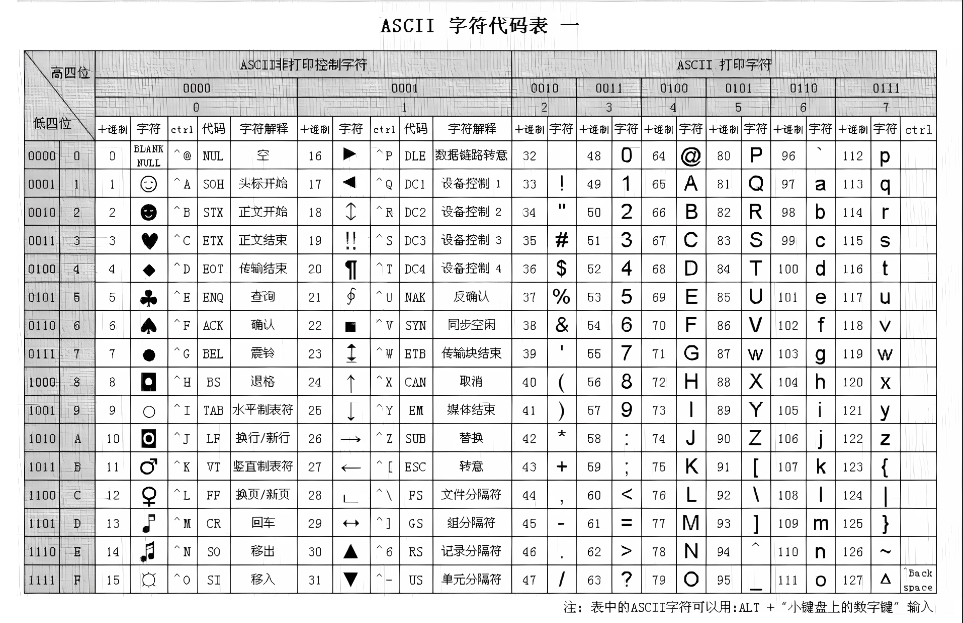

## cpp
1. 数制转换
    - cout 默认以十进制显示
    - count<<oct 显示八进制
    - count<<hex 显示十六进制
    - count<<bitset<?> 显示二进制(?表示需要显示的二进制位数) 需要引入bitset头文件
    - cin 还会自动跳过 空格 回车 制表符 将分段输入的变量一次性赋值给多个变量
    - cin默认按照空格 制表符分段赋值变量 使用cin.getline或cin.get改为读取换行符
    - cin.getline读取到换行符并改为空字符 cin.get读取到换行符不存储换行符
2. 几个编码建议
    - cpp几乎不使用宏
        - 使用const enum代替常量宏 
        - 使用inline代替宏函数(函数体量小且被频繁调用)
    - 必要在使用变量前先声明 保证变量都会被立刻初始化
    - 内存的创建与销毁 
        - 使用new替代malloc 
        - 使用delete代替free
    - 尽量少使用数组和c风格的字符 
        - 使用string代替char *
        - 使用vector代替数组
    - 避免使用void * 指针算数 联合 强制, 大多数情况下合理的设计可以避免使用强制
    - 将程序设计由一堆类和对象表达相互作用 而不是一堆数据结构和可拨弄的二进制数据那样既不方便操作也容易造成安全问题
    - 尽量使用const代替#define 可用提前明确类型和作用域 const类型变量都大写方便识别
3. 存储类关键字说明
   - auto 声明变量时根据初始化表达式自动推断该变量的类型 c17已废弃
   - register 定义存储在寄存器中而不是 RAM 中的局部变量 c17已废弃
4. 基本数据类型(默认都是signed类型)
   - bool 只包含true false 所有非0都自动转化为true 0转化为false
   - char 至少1byte=8bit
   - short  至少2byte=16bit  -2^15~2^15-1(-32768~32767) 0~2^16-1(0~65535)
   - int  至少和short一样长
   - long  至少4byte=32bit 且至少和int一样长
   - long long  至少8byte=64bit 且至少和long一样长 c11新增
   - float  至少4byte=32bit 使用后缀f或F标识
   - double  至少6byte=48bit 且至少和float一样长 通常为8byte=64bit 使用后缀d或D标识 浮点数默认初始化为double
   - long double 至少和double一样长 一般有10byte=80bit 12byte=96bit 16byte=128bit 使用后缀l或L标识 尽量使用L避免认读歧义
5. 字符
   - 
   - wchar_t 常用的字符可用用char 需要支持unicode编码字符使用宽字符 一般默认和short占内存大小一致
   - cin cout 默认是char字符流不适合处理wchar_t 可用用wcin wcout 通过加前缀L标识宽字符
   - char16_t 16bit无符号字符使用前缀u 用于代替wchar_t c11新增
   - char32_t 32bit无符号字符使用前缀U 用于代替wchar_t c11新增
6. 指针和引用
   - 定义指针 一定要初始化为一个确定的适当的地址