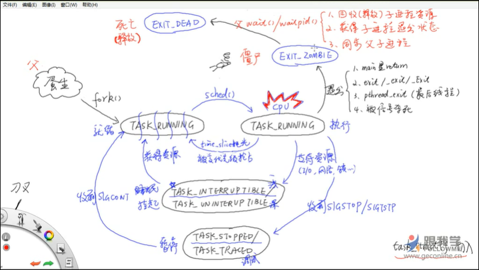

### linux c笔记
1. ANSI C
    为避免语法差异指定的国际c语法标准
2. gcc编译c源代码
	- 预编译(Preprocessing 处理头文件)  
		gcc -E a.c -i a.i  
        查找引入头文件 替换宏定义(不考虑语法规则)
	- 编译(Compilation 将源代码编译成汇编)  
		gcc -S a.i -o a.s
	- 汇编(Assembly 汇编文件成目标文件)  
		gcc -c a.s -o a.o
	- 链接(Linking 链接目标文件成可执行文件)  
		gcc a.o -o a
	- 上面4个步骤可以集成一步  
		gcc a.c -o a  
3. 多源文件编译输出到同一个可执行文件  
    - 直接编译源代码  
        gcc 1.c 2.c 3.c -o a.out
    - 代码中使用#include引入其他源文件
    - 先编译其他源代码  
        gcc -c 1.c -o 1.o  
        gcc 1.o 2.c -o a.out
    - 编写.h头文件  
        将函数的声明写成头文件 可以分开编译不同c源文件
    - 编写MakeFile  
    ```MakeFile
    num.out:num.o num_demo.c
        gcc num.o num_demo.c -o num.out
    num.o:num.c
        gcc -c num.c -o num.o
    ```
4. main函数
    ```c
    int main(int argv, char *argc[])
    {
        printf("%d,%s\n", argv, argc);
        for(int i=0;i<argv;i++)
        {
            printf("%s\n", argc[i]);
        }
        return 0;
    }
    ```
    - 返回值0表示程序执行成功  
    返回其他数值可以表示错误错误码 使用echo $?查看代码返回值
    - 参数argv表示一共输入了多少个参数
    - 参数argc表示每个参数的具体内容
5. 标准流
    - 输入流stdin  
    默认将从键盘读取数据到内存
    - 输出流stdout  
    默认将内存数据输出到显示器
    - 错误流stderr  
6. 内存管理
    - 1Byte=8bit (1字节=8位)
    - 所有内存均由os管理
    - os分配每个进程的地址 并对内存进项规划
    - 32位os
        - 指地址总线32位
        - 最大寻址空间32位即2^32=4G
        - 64位os 预留高12位 其他进程使用48位
        - 变量本质是内存
        - 指针本质是内存地址
7.  |地址|说明|作用域|
    |:-:|:-:|:-:|
    |0xffffffffffffffff|64位最大地址|系统内存|
    |0x7fffffffffffffff|48位最大地址|栈|
    |0x7fffffffffffffff|48位最大地址|动态分配|
    |0x7fffffffffffffff|48位最大地址|堆|
    |0x7fffffffffffffff|程序中声明的变量|数据段|
    |0x7fffffffffffffff|源代码编译后的二进制文件|代码块|
### c笔记
1. 数据类型
    - 基本类型
        - 整形
        - 字符
        - 浮点型
    - 构造类型
        - 枚举
        - 数组
        - 结构体
        - 共同体
    - 指针类型
    - 空类型
2. 数据取值范围
    | 数据类型| 字节| 取值范围|
    | :-: | :-: | :-:|
    | char| 1 ||
    |short (int)| 2 | -2^8~2^8-1 |
    |long (int)| 4 | -2^16~2^16-1 |
    |unsigned short (int)| 2 | 0~2^16-1 |
    |unsigned long (int)| 4 | 0~2^32-1 |
    |int|2(32bit) | -2^8~2^8-1 |
    |int|4(64bit) | -2^16~2^16-1 |
    |unsigned int| 2 | 0~2^16-1 |
    |float| 4 |  |
    |double| 8 |  |
    |long double| 16 |  |
    |pointer| 8 |  |
3. 运算符优先级
    | 优先级 | 运算符 |
    | :-: | :-: |
    | 1 | () |
    | 2 | ! ++ -- |
    | 3 | * / % |
    | 4 | + - |
    | 5 | < > <= >= |
    | 6 | == != |
    | 7 | && |
    | 8 | \|\| |
    | 9 | ?: |
    | 10 | = += -= *= /= %= |
4. 变量存储方式
    - 静态存储  
    整个程序执行过程中都存在的变量  
        - 全局变量    
    - 动态存储  
    根据程序运行的需要而建立和释放的
        - 函数形式参数
        - 自动变量
        - 函数调用时的现场保护
        - 函数调用时的返回地址
5. 变量存储类别
    - 自动变量  
    使用auto声明 auto可以省略 属于动态存储方式
    - 静态变量  
    使用static声明 属于静态存储方式
        - 静态局部变量 定义在函数内部
        - 静态外部变量 定义在函数外部
    - 寄存器变量  
    使用register声明 为提高效率将局部变量存储在cpu寄存器内
        - 局部自动变量
        - 函数形参
    - 外部变量  
    使用extern声明  
    ```c
        int x = 100;
        int main()
        {
            // 函数内调用在函数外声明的变量
            extern int x = 10;
        }
    ```
5. 函数分类
    - 外部函数  
    可以被外部源文件引用的函数  
    使用extern声明 extern可以省略  
    系统默认所有函数是外部函数
    - 内部函数  
    只能在当前源文件内引用的函数  
    使用static声明
    - 内联函数  
    使用inline声明的函数
    在编译过程中会在调用处替换省去函数跳转时间
6. 数组  
    - 内存连续
    - 大小固定
    - 数据类型一致
    - 顺序存储
    - c语言没有提供访问数组长度函数
7. 二维数组
    - 初始化可以不指定大小
    - 可以不指定行数 但是需要指定列数
    ```c
    int arr[2][2] = {{1,2},{3,4}};
    int arr[][2] = {1,2,3,4};
    ```
7. 字符串
    ```c
    char str[] = "";
    char str[] = {'f','\0'};
    printf("%s", str);
    puts(str);
    ```
8. 宏定义
    - 使用#define 声明一个宏
    - 函数被频繁调用且函数体短小时可以将函数设计成宏
    - 使用反斜杠\将多行宏定义串联成一行
    - 宏定义只是简单替换没有类型  
    ```c  
    #define MAX(a,b)\
    ({\
        typeof(a) _a = a;\
        typeof(a) _b = b;\
        (void) (&_a == &_b);\
        (_a) > (_b) ? (_a) : (_b);\
    })
    ```
    - typedef 为变量 函数 等其他语言词设置别名
    - 头文件编写规范
    ```c head.h
    #ifndef _HEAD_H
    #define _HEAD_H
    #endif
    ```
### JNI
1. java源代码编译成class  
    javac HelloJNI.java
2. 运行class文件(可以跳过 此时运行也会报错)  
    java HelloJNI
3. 生成头文件  
    javah HelloJNI
4. 根据头文件编写c  
    自动生成的头文件不可删除不可修改 根据头文件内的方法签名提供对应的实现
5. 编译
    ``` shell
    gcc -m64 -Wl,--add-stdcall-alias -I"C:\Program Files\Java\jdk1.8.0_331\include" -I"C:\Program Files\Java\jdk1.8.0_331\include\win32" -shared -o HelloJNI.dll HelloJNI.c
    ```
6. 再次执行第二步  
    如果上面的步骤都没错 到这里所有的文件都已生成 可以正常运行
### 文件读写
1. 系统IO linux系统提供的文件读写接口
2. 标准IO C语言提供的文件读写接口
3. 打开文件mode
    - r     只读    文件必须存在
    - r+    读写    文件必须存在
    - w     只写    文件不存在则创建    文件存在则清空
    - w+    读写    文件不存在则创建    文件存在则清空
    - a     只写    文件不存在则创建    文件存在则追加
    - a+    读写    文件不存在则创建    文件存在则追加
    - b     二进制
4. 文件属性
    - stat 使用文件路径
    - fstat 使用文件描述符
    - lstat 使用文件路径
    ``` c
        struct stat {
            _dev_t st_dev; // 普通文件所在存储器设备号
            _ino_t st_ino; // 索引号 文件唯一序列号
            unsigned short st_mode; // 权限 类型
            short st_nlink; // 引用计数
            short st_uid; // 文件所有者
            short st_gid; // 文件所有者群组
            _dev_t st_rdev; // 特殊文件设备号
            _off_t st_size; // 文件大小
            time_t st_atime; // 最新访问时间
            time_t st_mtime; // 最近修改时间
            time_t st_ctime; // 创建时间
        };
    ```
5. 目录
    - linux系统的目录和windows的文件夹不是同一个概念
    - windows文件夹是文件的容器 像一颗倒置的树 子文件夹大小永远不可能超出父文件夹大小
    - linux目录是一种文件索引表 组成该表的是目录项(由文件名和文件索引构成)
    - opendir 使用文件路径读取目录
    - readdir 读取目录项
    ```c
    struct dirent {
        long		d_ino; // 指向文件索引号
        unsigned short	d_reclen;
        unsigned short	d_namlen;
        char		d_name[260]; // 文件名
    };
    ```
6. 输入子系统
 - 读取接入到系统内的具有输入性质的设置
 - 输入子事件都已经抽象到了 input_event 结构体内
### 系统编程
1. 源代码 程序 进程 线程
    - 源代码和程序都是静态概念 是存放在磁盘上指令的有序集合
    - 进程是动态概念 是一个程序的执行过程 包括程序的启动运行销毁完整的生命周期
    - 进程是资源调度的最小单位
    - 线程是系统调度的最小单位
2. 进程的状态
    - 
    - fork 复制得到当前进程组下的一个子进程 子进程拥有和父进程完全一样的资源
    - exit _exit 退出
    - wait waitpid 等待子进程运行结束
        - WIFEXITED     判断是否正常退出
        - WEXITSTATUS   如果正常退出 获得退出时的结束码
        - WIFSIGNALED   判断是否被信号量杀死
        - WTERMSIG      如果被信号量杀死 获得信号量
        - WCOREDUMP     如果被信号量杀死且转储为dump文件则为真
        - WIFSTOPPED    如果被信号暂停且option设置了WUNTRACED则为真
        - WSTOPSIG      如果被信号暂停 获得信号量
3. 守护进程 daemon
    - session 登录终端就会自动创建一个会话 使用setsid创建一个新的session没有终端与之相连
    - 前台进程组 负责和终端交互 输入输出
    - 后台进程组 使用&可以使一个前台进程脱离终端交互 但仍受用户退出影响
    - 守护进程  不受用户和其他进程影响 只和系统相关的进程
    - 守护进程创建步骤
        - 登录终端后自动开启session当前进程成为进程组组长
        - 复制出一个新的进程 新的进程开启新的session(进程组组长无法开启新session) fork setsid
        - 子进程和父进程仍处在同一个线程组 需要新建进程组以断绝原进程组信号对他的影响 setpgrp
        - 子进程是新session的创始人 仍有权限开启终端会受到系统信号干扰 再复制一个新的进程 fork
        - 关闭之前开启的资源文件描述符 释放资源
        - 设置新的工作路径 此路径应该是一个不可被卸载被删除的固定目录
4. 进程间通信 IPC
    - 传统通信方式
        - 匿名管道pipe 进程之间通过内核互相通信
        - 具名管道fifo
        - 信号signal
    - System V IPC 对象
        - 共享内存
        - 消息队列
        - 信号量
    - BSD socket 跨主机见进程通信
    - 匿名管道特点
        - 特殊文件 读写分开
        - 没有名字 无法通过文件名打开 所以只能用在具有亲缘关系进程之间通信
        - 数据不具备原子性 多进程间数据可以混杂甚至覆盖 所以只能用在一对一IPC
        - |有写者||无写者||
            |:-:|:-:|:-:|:-:|
            |有数据|无数据|有数据|无数据|
            |正常读取|阻塞|正常读取|立即返回0|
        - |有读者||无读者||
            |:-:|:-:|:-:|:-:|
            |缓冲区已满|缓冲区未满|缓冲区已满|缓冲区未满|
            |阻塞|正常写入|收到信号SIGPIPE broken pipe||
    - 具名管道特点
        - 普通文件 使用一个文件描述符操作
        - 有名字 可以通过文件名打开
        - 写入原子性
        - 适合多进程写入 数据量少